# Parcial II

Este Parcial tenia las siguientes caracteristicas:

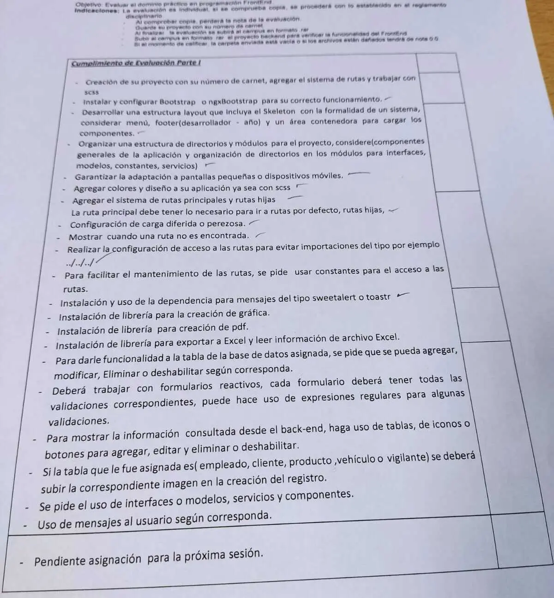

- Para este parcial se hizo uso de las entidades creadas para el modúlo debackend, en donde se tuvo que realizar una API , para el modúlo de Pedidos
- el proyecto es RP18027_parcial2

## Preview del proyecto

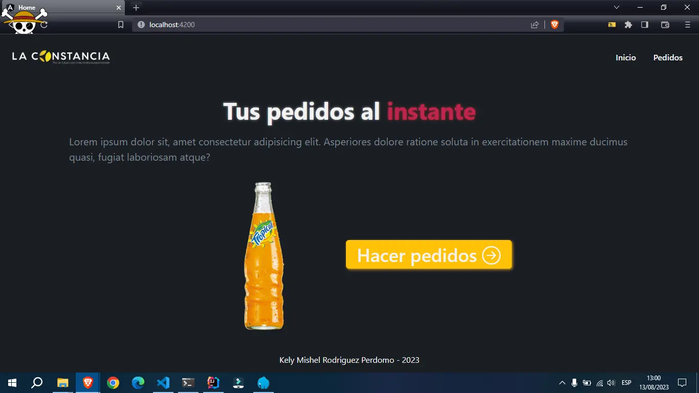
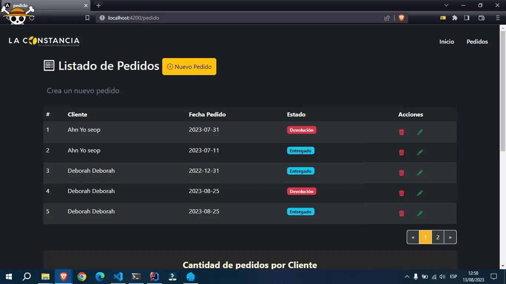
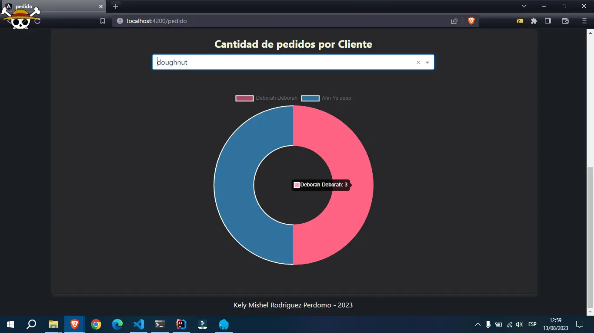
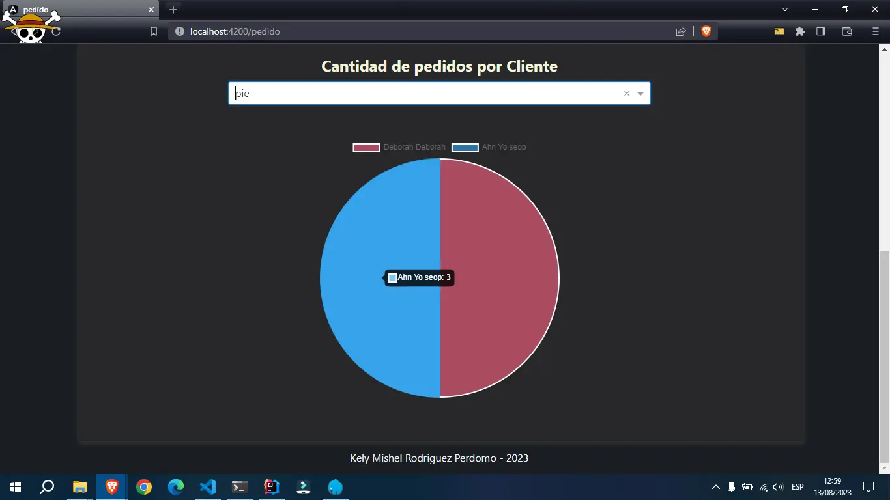
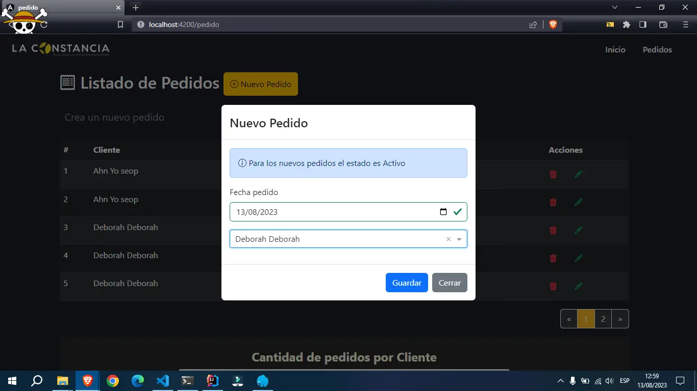
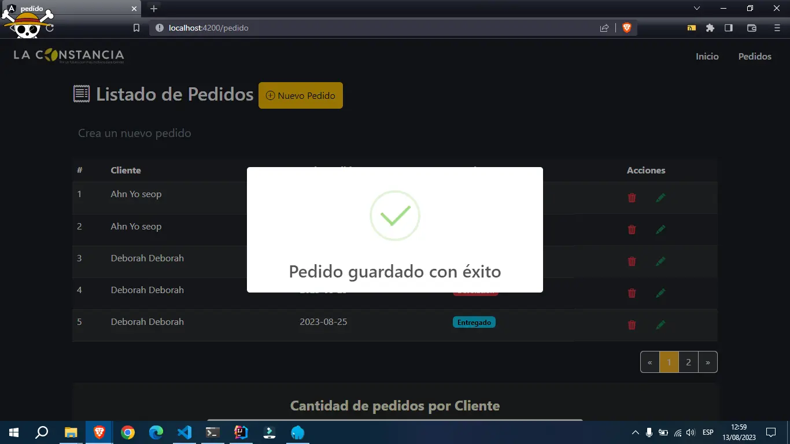
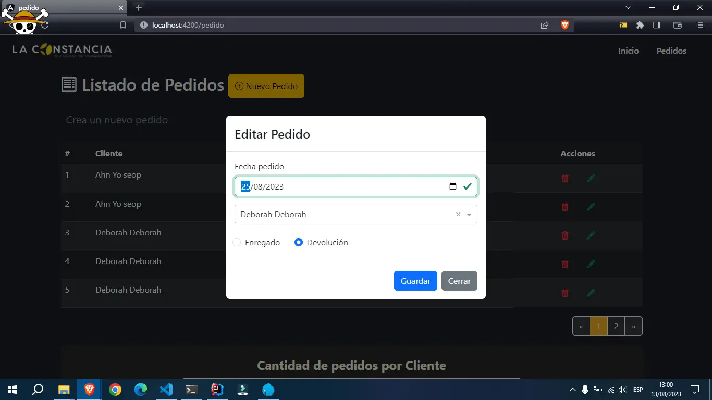
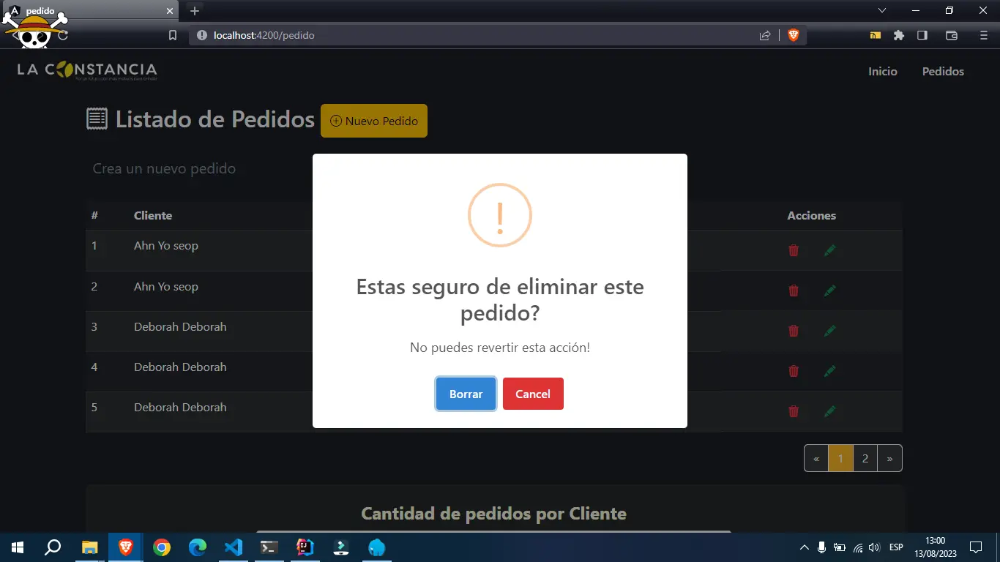
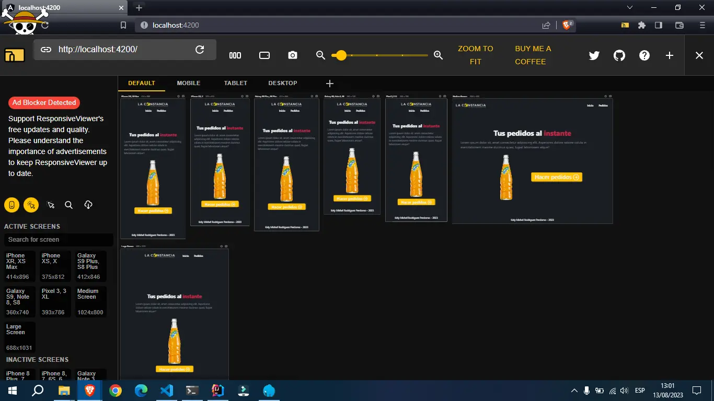
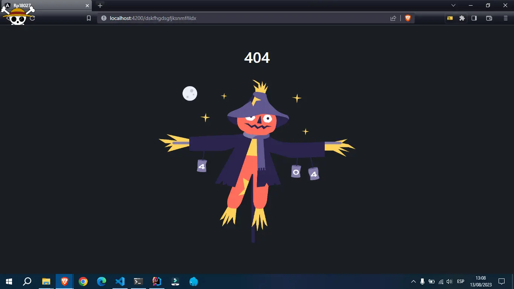

## ⚙ How Use

Para para iniciarlo solo hace falta un

```
npm instal --force
```

Y si deseas ver los datos con la API porsupuesto necesitas enceder la API y MYSQL
